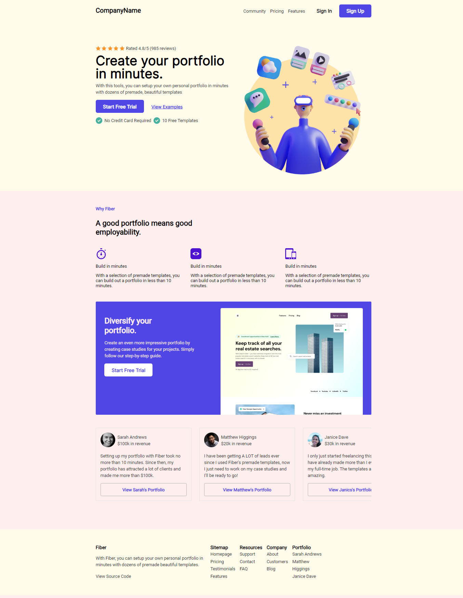

# Codewell challenge 01 HTML Template

Welcome to this simple, minimalistic HTML Template, a creation by Soriful Chalehin. This template offers a responsive and visually appealing design suitable for various web development projects. Explore the live demo [here](https://soriful-chalehin.github.io/fiber-template-clone/).



## Features

- **Responsive Design:** Ensure a seamless experience across a range of devices.
- **Svg Icons:** Enhance your website with scalable vector icons from Font Awesome.
- **Google Fonts:** Utilize beautifully crafted fonts from Google Fonts to enhance the visual appeal.

## Table of Contents

1. [Getting Started](#getting-started)
2. [Features](#features)
3. [Live Demo](https://soriful-chalehin.github.io/fiber-template-clone/)
4. [Contact the Developer](#contact-the-developer)
5. [License](#license)

## Getting Started

To begin with this template, clone the repository and explore the code. Use it as a foundation for your projects, customizing and extending it according to your needs.

```bash
git clone https://soriful-chalehin.github.io/fiber-template-clone.git
```

### Live Demo
Check out the live demo of the SnapAd HTML Template here.

### Contact the Developer
For any questions, suggestions, or to connect, reach out to Soriful Chalehin:

<ul>
    <li><a href='https://facebook.com/Chalehin'> Follow me on Faceobook.</li>
    <li><a href='https://soriful-chalehin.github.io'> Website.</li>
    <li><a href='mailto:developersoriful@gmail.com'> E-mail </li>
</ul>
License
This Template is licensed under the MIT License.
